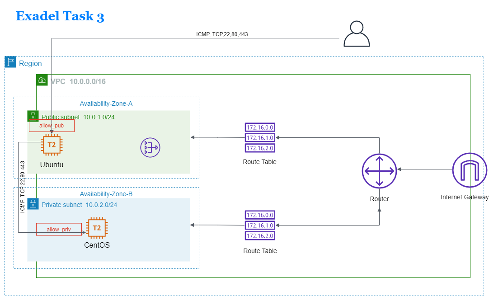

# Task 3 Terraform
#### Task 3 Diagram
 

## Task steps
### #1. I created new AWS profile on my PC
 
### #2. Created new VPC on networking module
    data "aws_availability_zones" "available" {}

    module "vpc" {
    source = "terraform-aws-modules/vpc/aws"
    name                             = "exadel-vpc"
    cidr                             = "10.0.0.0/16"
    azs                              = data.aws_availability_zones.available.names
    private_subnets                  = ["10.0.1.0/24"]
    public_subnets                   = ["10.0.2.0/24"]
    create_database_subnet_group     = true
    enable_nat_gateway               = true
    single_nat_gateway               = true
  
}
### #3. Created two AWS security groups
* Public: allowed  SSH,HTTP, HTTPS, ICMP inbound traffic over interet
* Private: allowed  SSH,HTTP, HTTPS, ICMP inbound traffic over private network

### #4. Created two AWS instances
* Ubuntu on public subnet

    resource "aws_instance" "web-server" {
    ami                     = data.aws_ami.latest-ubuntu.id
    instance_type           = "t2.micro"
    key_name                = "webserver-key"
    subnet_id               = module.networking.vpc.public_subnets[0]
    vpc_security_group_ids  = [module.networking.sg_pub_id]
    user_data               = "${file("installweb.sh")}"

    provisioner "file" {
        source      = "./centos-key.pem"
        destination = "/home/ubuntu/centos-key.pem"

        connection {
        type        = "ssh"
        user        = "ubuntu"
        private_key = file("webserver-key.pem")
        host        = self.public_ip
        }
    }
    provisioner "remote-exec" {
        inline = ["chmod 400 ~/centos-key.pem"]

        connection {
        type        = "ssh"
        user        = "ubuntu"
        private_key = file("webserver-key.pem")
        host        = self.public_ip
        }

    }

    tags = {
        Name = "Ubuntu-server"
    }
    }

* Centos on private subnet

    resource "aws_instance" "centos-server" {
    ami                         = data.aws_ami.centos.id
    instance_type               = "t2.micro"
    associate_public_ip_address = false
    key_name                    = "centos-key"
    subnet_id                   = module.networking.vpc.private_subnets[0]
    vpc_security_group_ids      = [module.networking.sg_priv_id]
    
    tags = {
        Name = "CentOS7-server"
    }

    }
