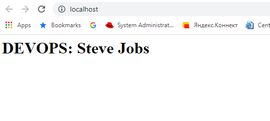

# Task 4 (Docker)
### #1. Docker installed via script file (Extra 1.1. also done simultaneously)

    #Docker installation
    sudo apt-get -y update
    sudo apt-get -y install \
        apt-transport-https \
        ca-certificates \
        curl \
        gnupg \
        lsb-release
    curl -fsSL https://download.docker.com/linux/ubuntu/gpg | sudo gpg --dearmor -o /usr/share/keyrings/docker-archive-keyring.gpg
    echo "deb [arch=amd64 signed-by=/usr/share/keyrings/docker-archive-keyring.gpg] https://download.docker.com/linux/ubuntu $(lsb_release -cs) stable" | sudo tee /etc/apt/sources.list.d/docker.list > /dev/null
    sudo apt-get -y update
    sudo apt-get -y install docker-ce docker-ce-cli containerd.io

**Note: Installation script "docker-install.sh" is located Task folder**

### #2. Running "Hello world" docker container 

    root@ip-10-0-2-118:/home/ubuntu# docker container run hello-world
    Unable to find image 'hello-world:latest' locally
    latest: Pulling from library/hello-world
    b8dfde127a29: Pull complete
    Digest: sha256:0fe98d7debd9049c50b597ef1f85b7c1e8cc81f59c8d623fcb2250e8bec85b38
    Status: Downloaded newer image for hello-world:latest

    Hello from Docker!
    This message shows that your installation appears to be working correctly.

    To generate this message, Docker took the following steps:
    1. The Docker client contacted the Docker daemon.
    2. The Docker daemon pulled the "hello-world" image from the Docker Hub.
        (amd64)
    3. The Docker daemon created a new container from that image which runs the
        executable that produces the output you are currently reading.
    4. The Docker daemon streamed that output to the Docker client, which sent it
        to your terminal.

    To try something more ambitious, you can run an Ubuntu container with:
    $ docker run -it ubuntu bash

    Share images, automate workflows, and more with a free Docker ID:
    https://hub.docker.com/

    For more examples and ideas, visit:
    https://docs.docker.com/get-started/

    root@ip-10-0-2-118:/home/ubuntu#

 ### Extra #2.1 Image with html page run. In the html page written text: \<Username> Sandbox 2021
    echo "<html><body><h2>islommamatov Sandbox 2021</h2></body></html>" > index.html
    docker run -dit --name my-apache-app -p 80:80 -v "$PWD":/usr/local/apache2/htdocs/ httpd:2.4

**Result**

### #3.1 For creating docker image I used debian:buster-slim
    FROM debian:buster-slim

    ENV DEVOPS "islommamatov"

    RUN apt-get update \
    && apt-get install -y apache2 \ 
    && service apache2 restart \
    && rm /var/www/html/index.html 

    COPY ./webpage.sh /usr/local/bin/webpage.sh

    RUN chmod a+x /usr/local/bin/webpage.sh

    ENTRYPOINT ["webpage.sh"]
    
    EXPOSE 80

### #3.2 Added an environment variable "DEVOPS = \<username> 
     ENV DEVOPS "islommamatov"

### #3.2.1 To change the environment variable for each restart the container we should write a script. 
    #!/bin/bash
    echo "<html><head><title>Exadel -Task4</title></head><body><h1>DEVOPS: $DEVOPS <h1></body></html>" > /var/www/html/index.html
    apachectl -DFOREGROUND 

#### Image building
    docker image build -t webserver:latest .
#### Running the container with custom env. variable
    docker run -itd -e DEVOPS="Steve Jobs" --rm -p 80:80 webserver:latest

#### Result: 

### #4. Pushing docker image to docker hub

#### We should login to Dockerhub
    docker login
    Authenticating with existing credentials...
    Login Succeeded

#### Tagging the image
    docker image tag webserver:latest islommamatov/webserver:0.1.1

#### Pushing the tagged image
    docker image push islommamatov/webserver:0.1.1
    The push refers to repository [docker.io/islommamatov/webserver]
    19ddf9a19369: Pushed
    123136496f90: Pushed
    fba0e575a68b: Pushed
    d0f104dc0a1f: Mounted from library/nextcloud
    0.1.1: digest: sha256:29aafd96c8aee183ec35538688d67338395d98bfad2e3208de0e03ba5660a884 size: 1155

### Extra #4.1 Integration of Docker image and Github repo.
**For security reason I created new private Github repo. In this repo created new Action file. After every push action, the image will push to the DockerHub**

*Username and password stored in Github Actions secrets*

    name: Publish Docker Image

    on:
    push:
        branches: [master]
    release:
        types:
        - published
    jobs:
    build: 
        runs-on: ubuntu-latest
        
        steps:
        - name: checkout
            uses: actions/checkout@v2
            
        - name: Build and push Docker 
            uses: mr-smithers-excellent/docker-build-push@v5
            with:
            image: islommamatov/webserver
            registry: docker.io
            username: ${{ secrets.DOCKER_USERNAME }}
            password: ${{ secrets.DOCKER_PASSWORD }}
      
### #5. Created docker-compose file. 
* First image is my webserver image, To run 5 nodes of first image I used "*--scale webserver=5*" keyword
* Second image is Jetty java app
* Last image is official MySql image
* Java app run after a successful run of MySQL container 
        depends_on: 
        - docker-mysql

### EXTRA #5.1. Created env files for each service 
        ...
        env_file:
            - webserver-env/.env
        ...
        env_file:
        - java-env/.env
        ...
        env_file:
        - db-env/.env
        ...

*Note: .env files are not included git repo*

#### docker-compose.yml file
    version: '3'
    services:
    #Web Server
    webserver:
        restart: always
        build: .
        ports:
        - "80"
        env_file:
        - webserver-env/.env

    # A Java App
    java-app:
        restart: always
        container_name: java-app
        image: jetty
        ports:
        - "8080:8080"
        env_file:
        - java-env/.env 
        depends_on: 
        - docker-mysql 

    # DB 
    docker-mysql:
        restart: always
        container_name: docker-mysql
        image: mysql
        env_file:
        - db-env/.env
        volumes:
        - ./sql:/docker-entrypoint-initdb.d

        ports:
        - "6033:3306"
        healthcheck:
        test: "/usr/bin/mysql --user=root --password=root--execute \"SHOW DATABASES;\""
        interval: 2s
        timeout: 20s
        retries: 10
  
  
#### Runnung the containers
    docker-compose up -d --scale webserver=5
    Creating network "my-apache_default" with the default driver
    Creating my-apache_webserver_1 ... done
    Creating my-apache_webserver_2 ... done
    Creating my-apache_webserver_3 ... done
    Creating my-apache_webserver_4 ... done
    Creating my-apache_webserver_5 ... done
    Creating docker-mysql          ... done
    Creating java-app              ... done