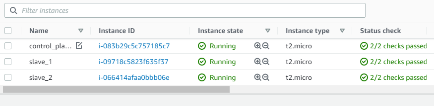
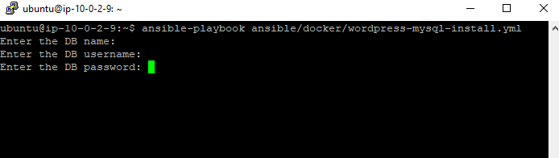

# Task 5. Ansible

### 1. Deployed three virtual machines in the Cloud. One of them control plane, others are slaves.

**In the Control VM installed Ansible**

    sudo apt update
    sudo apt install software-properties-common
    sudo apt-add-repository ppa:ansible/ansible
    sudo apt update
    sudo apt install ansible

**Generated new SSH key-pair**

    ssh-keygen 
    cat .ssh/id_rsa.pub

**In the Slave VMs copied the public key and installed Python**

     nano .ssh/authorized_keys
     sudo apt update
     sudo apt install python3

**Ansible hosts file configured**

    [exadel]
    slave_1 ansible_ssh_host=10.0.2.183
    slave_2 ansible_ssh_host=10.0.2.193

### 2. Connection tested with ping command

    ansible -m ping all

    slave_1 | SUCCESS => {
        "ansible_facts": {
            "discovered_interpreter_python": "/usr/bin/python"
        },
        "changed": false,
        "ping": "pong"
    }

    slave_2 | SUCCESS => {
        "ansible_facts": {
            "discovered_interpreter_python": "/usr/bin/python"
        },
        "changed": false,
        "ping": "pong"
    }

### 3. Installed Docker image on two machines

    ---
    - hosts: all
      become: true
  
      tasks:
        - name: Install aptitude
          apt: name=aptitude state=latest update_cache=yes force_apt_get=yes

        - name: Install system packages
          apt: name={{ item }} state=latest update_cache=yes
          loop: [ 'apt-transport-https', 'ca-certificates', 'curl', 'software-properties-common', 'python3-pip', 'virtualenv', 'python3-setuptools']
 
        - name: Docker GPG apt Key Adding
          apt_key:
            url: https://download.docker.com/linux/ubuntu/gpg
            state: present

        - name: Adding Docker Repo
          apt_repository:
            repo: deb https://download.docker.com/linux/ubuntu bionic stable

        - name: Update apt and install docker-ce
          apt: update_cache=yes name=docker-ce state=latest

        - name: Install Docker Module for Python
          pip:
            name: docker

        - name: Pull hello world image
          docker_image:
            name: hello-world
            source: pull

        - name: Create Hello World container
          docker_container:
            name: hello-world
            image: hello-world
            state: started
            ports:
            - "80:80" 

### EXTRA 1. Wordpress, MySQL installed in the docker

    ---
    - hosts: all
      become: true
      vars_prompt:

        - name: wp_db_name
          prompt: Enter the DB name

        - name: db_user
          prompt: Enter the DB username
        
        - name: db_password
          prompt: Enter the DB password

    vars:
        db_host: db
        wp_name: wordpress
        docker_network: wordpress_net
        #wp_host_port: "{{ lookup('env','WORDPRESS_PORT') | default(8080)}}"
        wp_container_port: 80
    
    tasks:
    
        - name: "Create a network"
          docker_network:
            name: "{{ docker_network }}"

        - name: Pull wordpress image
          docker_image:
            name: wordpress
            source: pull

        - name: Pull MySQL image
          docker_image:
            name: mysql:5.7
            source: pull    

        - name: Create DB container
          docker_container:
            name: "{{ db_host }}"
            image: mysql:5.7
            state: started
            # ports:
            #   - "3306"
            network_mode: "{{ docker_network }}"
            env:
            MYSQL_USER: "{{ db_user }}"
            MYSQL_PASSWORD: "{{ db_password }}"
            MYSQL_DATABASE: "{{ wp_db_name }}"
            MYSQL_RANDOM_ROOT_PASSWORD: '1'
            volumes:
            - db:/var/lib/mysql:rw
            restart_policy: always

        - name: Create Wordpress container
          docker_container:
            name: "{{ wp_name }}"
            image: wordpress:latest
            state: started
            ports:
            - "80:80" 
            restart_policy: always
            network_mode: "{{ docker_network }}"
            env:
            WORDPRESS_DB_HOST: "{{ db_host }}:3306"
            WORDPRESS_DB_USER: "{{ db_user }}"
            WORDPRESS_DB_PASSWORD: "{{ db_password }}"
            WORDPRESS_DB_NAME: "{{ wp_db_name }}"
            volumes:
            - wordpress:/var/www/html

**wordpress-mysql-install.yml file exists in the github repo**

### EXTRA 2. DB creds are not included the playbook. User can input them while creating container

### EXTRA 3. For solving this task I used amazon.aws.aws_ec2 plugin

#### To install this plugin we use following command:

    ansible-galaxy collection install amazon.aws
Plugin installed

    ubuntu@ip-10-0-2-9:~/ansible$ ansible-galaxy collection install amazon.aws
    Process install dependency map
    Starting collection install process
    Installing 'amazon.aws:1.5.0' to '/home/ubuntu/.ansible/collections/ansible_collections/amazon/aws'

#### Created *aws_ec2.yaml* file

    plugin: aws_ec2
    regions:
    - eu-central-1
    keyed_groups:
    - key: tags.group
        separator: ""

#### Created new Role

#### Attached this role to the Control node

#### To check inventory typed following command:

ansible-inventory -i aws_ec2.yaml --list

#### Now we can check this inventory with ping

    ansible exadel -i aws_ec2.yaml -m ping --private-key webserver-key.pem -u ubuntu

**Result**

 

 ### Links to WebPages

 * Link1 => http://3.67.196.196/    
 * Link2 => http://18.193.71.127/

 **All steps done I hope ;)**