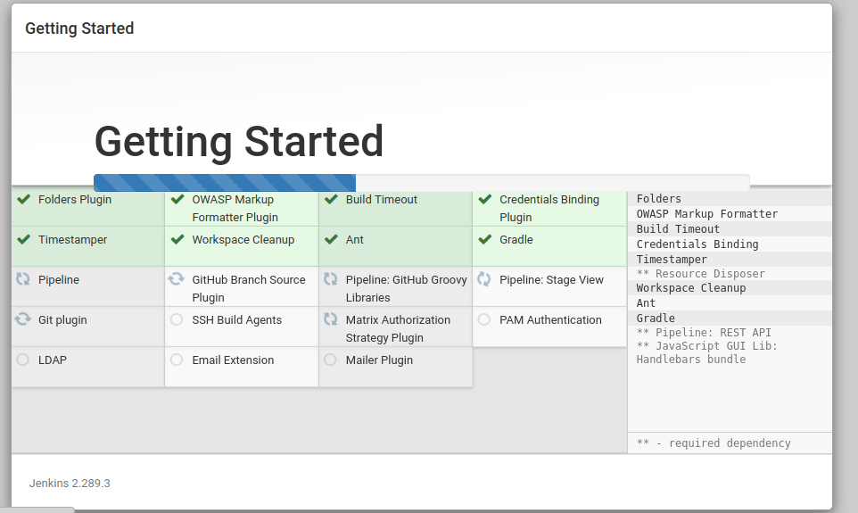
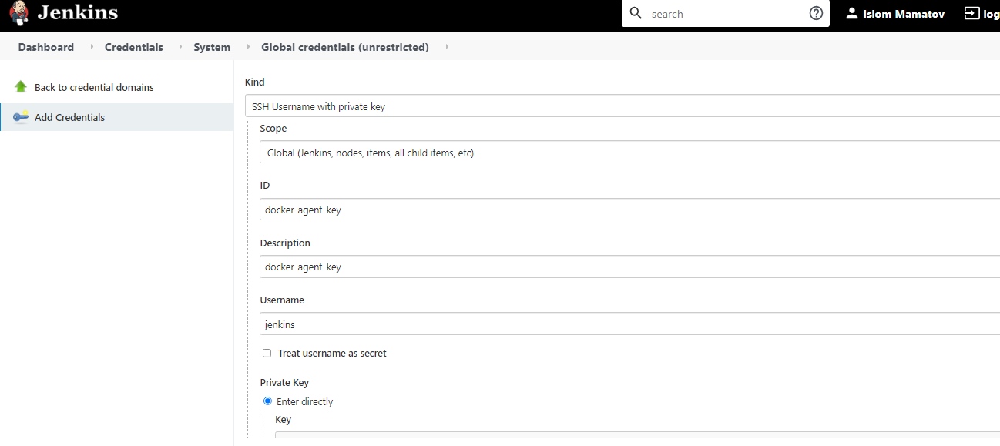
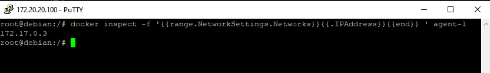
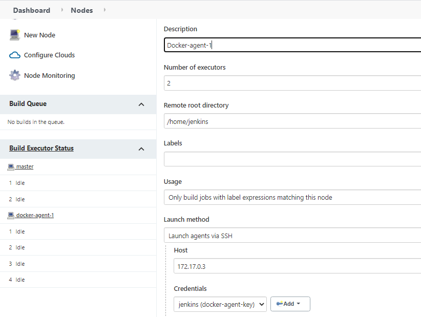
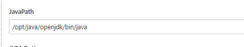
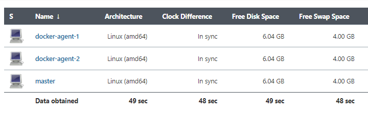
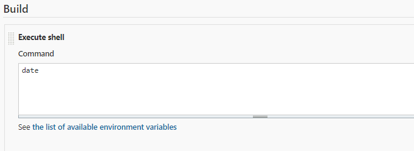
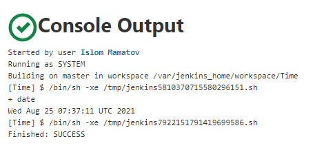
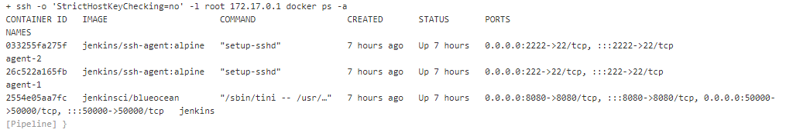

# Task 6: Jenkins. Automate, Manage and Control

### #1. For install jenkins in docker container we use following command

    docker run -d -v jenkins_home:/var/jenkins_home -p 8080:8080 -p 50000:50000 --name jenkins jenkinsci/blueocean

*I used jenkinsci/blueocean image*

### #2. After installation the Jenkins, installed some plugins

### #3. For adding Docker Agents I did following steps:
 **Step 1: Generated new ssh key pair**

    ssh-keygen -f ~/.ssh/jenkins_agent_key
    Generating public/private rsa key pair.
    Enter passphrase (empty for no passphrase):
    Enter same passphrase again:
    Your identification has been saved in /root/.ssh/jenkins_agent_key.
    Your public key has been saved in /root/.ssh/jenkins_agent_key.pub.
    The key fingerprint is:
    SHA256:c20+cWdIHaNuBIaUxIQATOb5bWuxs8vuM7oiBaLpdvI root@debian
    The key's randomart image is:
    +---[RSA 2048]----+
    |  o+... *+oo   o |
    |  o..  . +. . ..o|
    |   o         o. .|
    |..  . .    .o. . |
    |o..  . +S . +oo o|
    |o  .  . +o o.o o |
    |. .    =    o    |
    | = o  ooo    .   |
    |. =E.o=*+        |
    +----[SHA256]-----+

**Step 2: Created a Jenkins SSH credential**

 

**Step 3: Created a Docker agent container**

    docker run -d --rm --name=agent-1 -p 2222:22 \
    -e "JENKINS_AGENT_SSH_PUBKEY= [DOCKER AGENT PUBLIC KEY]" \
    jenkins/ssh-agent:alpine

**Step 4: We should define agent ip address**

 

**Step 5: Created new agent node on Jenkins GUI**

 

**Step 6. JAVA Path changed**

 

**Agent successfully connected**

    <===[JENKINS REMOTING CAPACITY]===>channel started
    Remoting version: 4.7
    This is a Unix agent
    Evacuated stdout
    Agent successfully connected and online
    The Agent is connected, disconnect it before to try to connect it again.

**I added 2 Docker agents**

 

### #4. Created Freestyle project which will show the current date as a result of execution

  

**Result**

 

### #5. Created Pipeline which will execute docker ps -a in docker agent, running on Jenkins master’s Host.

    pipeline {
        agent any
        stages {
            stage("build") {
                steps {
            sshagent(credentials: ['Jenkins-server']) {
                sh '''
                    ssh -o StrictHostKeyChecking=no -l root 172.17.0.1 docker ps -a
                
                '''
            }
        }
            }
        }
    }

**Result**

 

