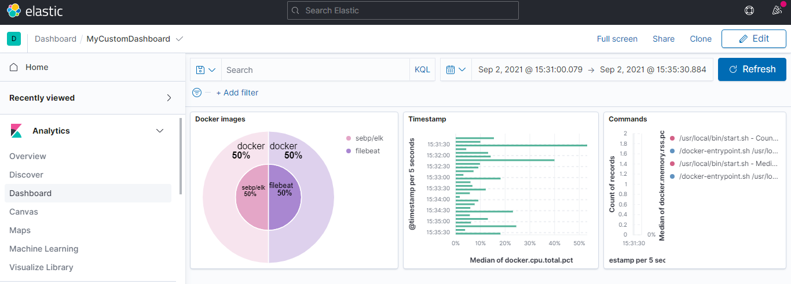
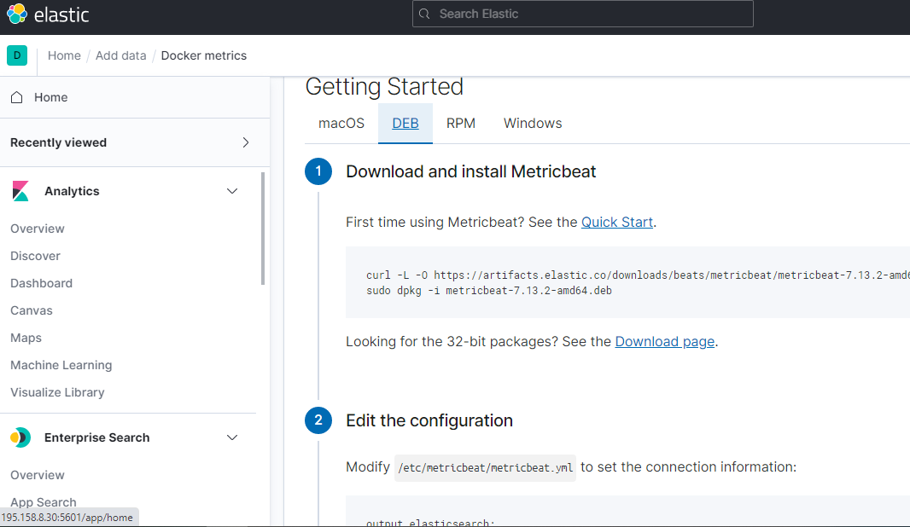
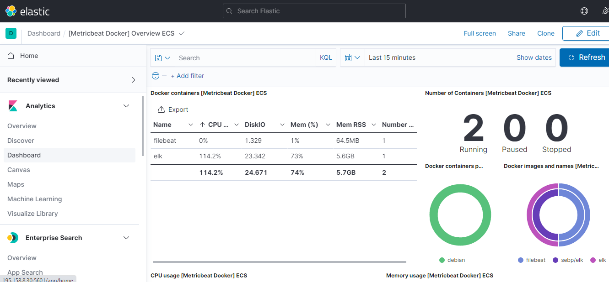
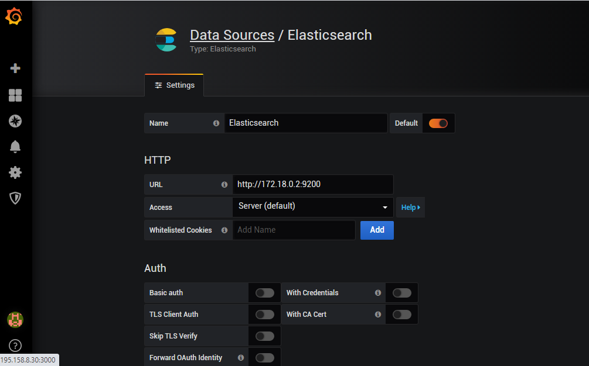
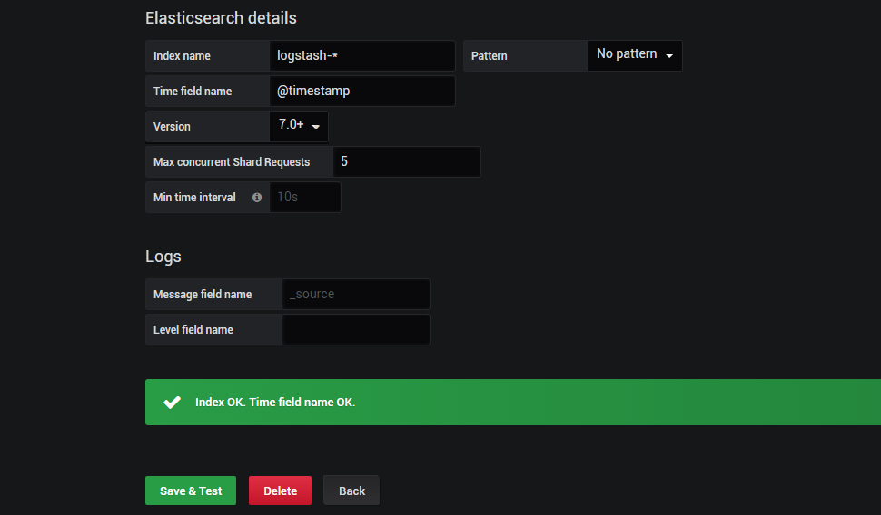
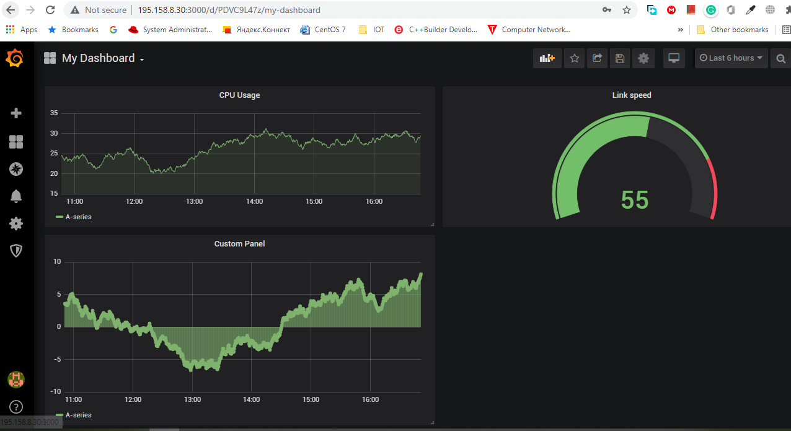

# Task 7: Logging & Monitoring

## Tasks:
## 1. Zabbix:
**Big brother is watching  ....**
### 1.1 Install on server, configure web and base
I installed Zabbix server on a Ubuntu 20.04 host.

**Step1. Installed Zabbix repository**

    # wget https://repo.zabbix.com/zabbix/5.4/ubuntu/pool/main/z/zabbix-release/zabbix-release_5.4-1+ubuntu20.04_all.deb
    # dpkg -i zabbix-release_5.4-1+ubuntu20.04_all.deb
    # apt update

**Step2. Installed Zabbix server, frontend, agent**

    # apt install zabbix-server-mysql zabbix-frontend-php zabbix-apache-conf zabbix-sql-scripts zabbix-agent

**Step3. Created initial database**

    # mysql -uroot -p password
    mysql> create database zabbix character set utf8 collate utf8_bin;
    mysql> create user zabbix@localhost identified by 'password';
    mysql> grant all privileges on zabbix.* to zabbix@localhost;
    mysql> quit;

**Step4. On Zabbix server host imported initial schema and data.**

    # zcat /usr/share/doc/zabbix-sql-scripts/mysql/create.sql.gz | mysql -uzabbix -p zabbix

**Step5. Started Zabbix server and agent processes**

    # systemctl restart zabbix-server zabbix-agent apache2
    # systemctl enable zabbix-server zabbix-agent apache2

Zabbix server is ready now. Link: http://zabbix.samtuit.uz/zabbix

### 1.2 Prepare VM or instances.

I prepared two VM for Zabbix agent
* Jenkins server = 172.20.20.100
* Web server  = 172.20.20.20

### 1.2.1 Install Zabbix agents on previously prepared servers or VM.

Please, go to section EXTRA 1.2.2

### EXTRA 1.2.2: Complete 1.2.1 using ansible

It is my **zabbix-agant.yml** file:

    ---
    - hosts: all
    become: true
    vars:
        zbx_srv: 172.20.20.40
        centos7_link: https://repo.zabbix.com/zabbix/4.4/rhel/7/x86_64/zabbix-release-4.4-1.el7.noarch.rpm
        debian8_link: https://repo.zabbix.com/zabbix/4.4/debian/pool/main/z/zabbix-release/zabbix-release_4.4-1+jessie_all.deb
        debian8_file: zabbix-release_4.4-1+jessie_all.deb
        debian9_link: https://repo.zabbix.com/zabbix/4.4/debian/pool/main/z/zabbix-release/zabbix-release_4.4-1+stretch_all.deb
        debian9_file: zabbix-release_4.4-1+stretch_all.deb
        debian10_link: https://repo.zabbix.com/zabbix/4.4/debian/pool/main/z/zabbix-release/zabbix-release_4.4-1+buster_all.deb
        debian10_file: zabbix-release_4.4-1+buster_all.deb
        ubuntu16_link: https://repo.zabbix.com/zabbix/4.4/ubuntu/pool/main/z/zabbix-release/zabbix-release_4.4-1+xenial_all.deb
        ubuntu16_file: zabbix-release_4.4-1+xenial_all.deb
        ubuntu18_link: https://repo.zabbix.com/zabbix/4.4/ubuntu/pool/main/z/zabbix-release/zabbix-release_4.4-1+bionic_all.deb
        ubuntu18_file: zabbix-release_4.4-1+bionic_all.deb
    
    tasks:
        - name: check OS
        debug: msg={{ansible_distribution}}-{{ansible_distribution_version}}
    
        - name: "Install zabbix-agent on Debian 10"
        get_url:
            url: "{{ debian10_link }}" 
            dest: "/tmp/{{ debian10_file }}"
        when: ansible_distribution_release == 'buster'

        - name: install zabbix deb in Debian 10
        apt: deb="/tmp/{{ debian10_file }}"
        when: ansible_distribution_release == 'buster'

    ### Ubuntu 18.04 Bionic
        - name: download zabbix deb file fot Ubuntu 18.04
        get_url:
            url: "{{ ubuntu18_link }}"
            dest: "/tmp/{{ ubuntu18_file }}"
        when: ansible_distribution_release == 'bionic'

        - name: install zabbix-agent Ubuntu 18.04
        apt:
            name: zabbix-agent
            state: latest
            update_cache: yes
        when: ansible_distribution_release == 'bionic'

    ##### enabled zabbix-agent
        - name: enable service zabbix-agent and ensure it is not masked
        systemd:
            name: zabbix-agent
            enabled: yes
            masked: no
        become: yes 

    ##### check zabbix home dir and shell
        - name: Make sure a service is stopped
        systemd: state=stopped name=zabbix-agent
        become: yes

        - name: check zabbix home dir and shell
        user:
            name: zabbix
            shell: /bin/bash
            home: /etc/zabbix
        become: yes

    ##### mkdir /etc/zabbix/scripts and rights
        - name: mkdir /etc/zabbix/scripts and rights
        file:
            path: /etc/zabbix/scripts
            state: directory
            owner: zabbix
            group: zabbix
            mode: 0700
        become: yes

    ##### change zabbix_agentd.conf
        - name: change zabbix_agentd.conf Hostname
        lineinfile:
            path: /etc/zabbix/zabbix_agentd.conf
            state: present
            regexp: 'Hostname=Zabbix server'
            line: "Hostname={{ ansible_hostname }}"
        become: yes
        
        - name: change zabbix_agentd.conf ServerActive
        lineinfile:
            path: /etc/zabbix/zabbix_agentd.conf
            state: present
            regexp: 'ServerActive=127.0.0.1'
            line: "ServerActive={{ zbx_srv }}"
        become: yes

        - name: change zabbix_agentd.conf Server
        lineinfile:
            path: /etc/zabbix/zabbix_agentd.conf
            state: present
            regexp: 'Server=127.0.0.1'
            line: "Server={{ zbx_srv }}"
        become: yes

        - name: change zabbix_agentd.conf EnableRemoteCommands
        lineinfile:
            path: /etc/zabbix/zabbix_agentd.conf
            state: present
            regexp: '# EnableRemoteCommands=0'
            line: 'EnableRemoteCommands=1'
        become: yes

        - name: change zabbix_agentd.conf LogRemoteCommands
        lineinfile:
            path: /etc/zabbix/zabbix_agentd.conf
            state: present
            regexp: '# LogRemoteCommands=0'
            line: 'LogRemoteCommands=1'

    ### Starting zabbix-agent
        - name: Make sure a service is started
        systemd: state=started name=zabbix-agent
        become: yes

Run *ansible-playbook zabbix-agent.yml* command

### 1.3 Make several of your own dashboards, where to output data from your triggers (you can manually trigger it)

I added new Dashboard and created new trigger.

### 1.4 Active check vs passive check - use both types.

If we use the Zabbix agent in the passive mode, it means that the poller (internal server process) connects to the agent on port 10050/TCP and polls for a certain value (e.g., host CPU load). The poller waits until the agent on the host responds with the value. Then the server gets the value back, and the connection closes.

In the active mode, all data processing is performed on the agent, without the interference of pollers. However, the agent must know what metrics should be monitored, and that is why the agent connects to the trapper port  10051/TCP of the server once every two minutes (by default). The agent requests the information about the items, and then performs the monitoring on the host and pushes the data to the server via the same TCP port.

### Active Check example

*Adding Item*

*Adding Tag*

*Adding Preproccessing*

### Passive Check example

 

*Adding Item*

*Adding Tag*

*Testing*

### 1.5 Make an agentless check of any resource (ICMP ping)

*Added new host "Agentless check"*

*Linked new template ICMP ping*

*Tested ICMP ping*

### 1.6 Provoke an alert - and create a Maintenance instruction

*Added a new Alert*

*Added a new Maintenance period*

### 1.7 Set up a dashboard with infrastructure nodes and monitoring of hosts and software installed on them

## 2. ELK:

*Nobody is forgotten and nothing is forgotten.*
### 2.1 Install and configure ELK

Pulled ELK docker image and run the container

    $ sudo docker run -p 5601:5601 -p 9200:9200 -p 5044:5044 -itd --name elk sebp/elk

By default, when starting a container, all three of the ELK services (Elasticsearch, Logstash, Kibana) are started.

### 2.2 Organize collection of logs from docker to ELK and receive data from running containers
For organize collection of logs from docker we should install and configure Filebeat

**Filebeat Dockerfile**

    # Dockerfile to illustrate how Filebeat can be used with nginx
    # Filebeat 7.13.2

    # Build with:
    # docker build -t filebeat-nginx-example .

    # Run with:
    # docker run -p 80:80 -it --link <elk-container-name>:elk \
    #     --name filebeat-nginx-example filebeat-nginx-example

    FROM nginx
    MAINTAINER Sebastien Pujadas http://pujadas.net
    ENV REFRESHED_AT 2020-10-02

    ###############################################################################
    #                                INSTALLATION
    ###############################################################################

    ### install Filebeat

    ENV FILEBEAT_VERSION 7.13.2
    ENV FILEBEAT_BASE_VERSION 7.13.2

    RUN apt-get update -qq \
    && apt-get install -qqy curl \
    && apt-get clean

    RUN curl -L -O https://artifacts.elastic.co/downloads/beats/filebeat/filebeat-${FILEBEAT_VERSION}-amd64.deb \
    && dpkg -i filebeat-${FILEBEAT_VERSION}-amd64.deb \
    && rm filebeat-${FILEBEAT_VERSION}-amd64.deb

    ###############################################################################
    #                                CONFIGURATION
    ###############################################################################

    ### tweak nginx image set-up

    # remove log symlinks
    RUN rm /var/log/nginx/access.log /var/log/nginx/error.log

    ### configure Filebeat

    # config file
    ADD filebeat.yml /etc/filebeat/filebeat.yml
    RUN chmod 644 /etc/filebeat/filebeat.yml

    # CA cert
    RUN mkdir -p /etc/pki/tls/certs
    ADD logstash-beats.crt /etc/pki/tls/certs/logstash-beats.crt

    # create template based on filebeat version (assumption: it is the same version as elasticsearch version)
    RUN filebeat export template --es.version ${FILEBEAT_BASE_VERSION} > /etc/filebeat/filebeat.template.json

    ###############################################################################
    #                                    DATA
    ###############################################################################

    ### add dummy HTML file

    COPY html /usr/share/nginx/html

    ###############################################################################
    #                                    START
    ###############################################################################

    ADD ./start.sh /usr/local/bin/start.sh
    RUN chmod +x /usr/local/bin/start.sh
    CMD [ "/usr/local/bin/start.sh" ]

**Example Filebeat set-up and configuration**

    output:
    logstash:
        enabled: true
        hosts:
        - elk:5044
        timeout: 15
        ssl:
        certificate_authorities:
            - /etc/pki/tls/certs/logstash-beats.crt

    filebeat:
    inputs:
        -
        paths:
            - /var/log/syslog
            - /var/log/auth.log
        document_type: syslog
        -
        paths:
            - "/var/log/nginx/*.log"
        fields_under_root: true
        fields:
            type: nginx-access

**Built an image from the Dockerfile**

    cd nginx-filebeat
    docker buld . filebeat

**Run the container**

    docker run -itd --name filebeat filebeat

 For forwarding logs from a Docker container to the ELK container on a host, we need to connect the two containers. So, we have to create new network bridge

    docker network create -d bridge elknet

Now, we can run log-emitting container

    docker run -p 80:80 -it --network=elknet imageName

### 2.3 Customize your dashboards in ELK
 
**Created custom Dashboard**

### 2.5 Configure monitoring in ELK, get metrics from your running containers
**I configured and installed Docker Metrics using this manual:**

**Result:**

## 3. Grafana: 

## 3.1 Install Grafana

**I installed Grafana as Docker container**

    docker run -d -p 3000:3000 --name grafana grafana/grafana:6.5.0

## 3.2 Integrate with installed ELK

**We will download the logs.jsonl file from the elastic servers:**

    curl -O https://download.elastic.co/demos/kibana/gettingstarted/7.x/logs.jsonl.gz

**Gunzip the file:**

    gunzip logs.jsonl.gz

**And finally, upload to our Elasticsearch instance:**

    curl -H 'Content-Type: application/x-ndjson' -XPOST 'localhost:9200/_bulk?pretty' --data-binary @logs.jsonl

**Added a datasource of type Elasticsearch**

**Datasource tested and saved**

### 3.3 Set up Dashboards

**I created a new Dashboard**

Thank you for your patience! 